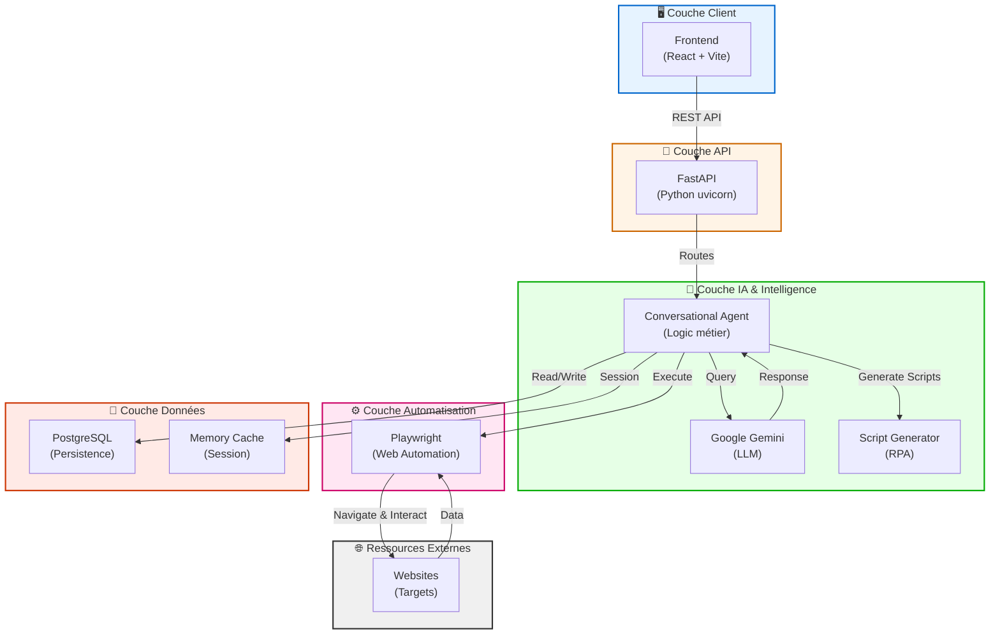
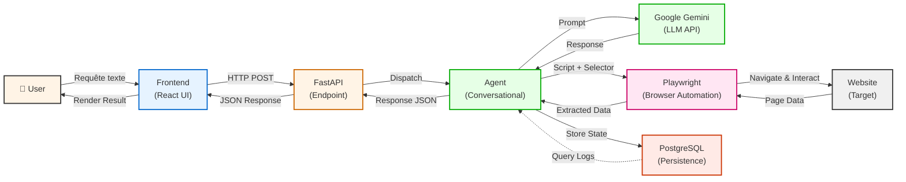

# 🏗️ Architecture Globale - Web Agent Chatbot

## 1. Architecture système complète

## 2. Flux de Données : User → Frontend → FastAPI → Agent → Gemini → Playwright → Website

## 3. Composants clés

| Couche | Composant | Rôle | Tech |
|--------|-----------|------|------|
| **Client** | Frontend | Interface utilisateur, chat UI | React + Vite |
| **API** | FastAPI | Serveur API, routes REST | Python uvicorn |
| **IA** | Conversational Agent | Orchestration logique métier | Python |
| **IA** | Google Gemini | Génération texte/réponses LLM | API Google |
| **IA** | Script Generator | Génération scripts RPA | Python |
| **Automatisation** | Playwright | Navigation & interaction web | Node.js / Python |
| **Externe** | Websites | Sites cibles du scraping/automation | HTTP |
| **Données** | PostgreSQL | Stockage persistant | SQL |
| **Données** | Memory Cache | Session/état temporaire | In-Memory |

---

✅ **Architecture professionnelle et scalable**  
📊 **Respecte les bonnes pratiques d'API REST et de microservices**  
🔄 **Cycle complet : User → Requête → Traitement IA → Automatisation → Résultat**
